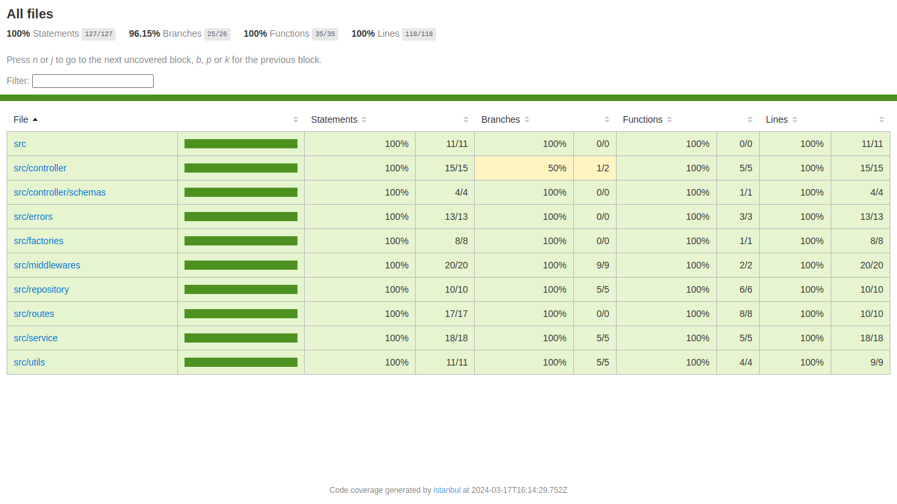

# Teste Fullstack: Aplicativo de Gerenciamento de Clientes

## Deploy do App na nuvem: [Deploy](http://18.216.84.173/) (Protocolo HTTP, talvez seja preciso conceder permissão do browser)

### Deploy Cloud:

- [AWS EC2](https://aws.amazon.com/pt/ec2/)

### Ferramentas Frontend:

- [Vite](https://vitejs.dev/)
- [React](https://pt-br.reactjs.org/)
- [TypeScript](https://www.typescriptlang.org/)
- [Yup](https://github.com/jquense/yup)
- [React-Toastify](https://fkhadra.github.io/react-toastify/introduction)
- [React Icons](https://react-icons.github.io/react-icons/)
- [React-hook-form](https://www.react-hook-form.com/)
- [Sass](https://sass-lang.com/)

### Ferramentas de Teste Frontend:

- [Vitest](https://vitest.dev/)
- [React Testing Library](https://testing-library.com/docs/react-testing-library/intro/)

### Ferramentas Backend:

- [TypeScript](https://www.typescriptlang.org/)
- [Express](https://pactumjs.github.io/)
- [Postgres](https://www.postgresql.org/)
- [Sequelize](https://sequelize.org/)
- [Zod](https://zod.dev/)

### Ferramentas de Teste Backend(Unitários e Integração):

- [Jest](https://jestjs.io/pt-BR/)
- [Supertest](https://www.npmjs.com/package/supertest)



### Endpoints Backend:

- Criar cliente => POST **/client**
- Retornar um cliente => GET **/clients/:id**
- Listar clientes com paginação => GET **/clients?page=0&size=5**
- Atualizar cliente => PUT **/clients/:id**

### Gerenciador de Containers:

- [Docker-compose](https://www.docker.com/)

## Rodar o projeto localmente:

```bash
    # Entre na pasta do backend
    $ cd backend

    # Instale as dependências
    $ npm install

    # Suba o container do banco de dados
    $ docker compose up -d

    # Deixe rodando em plano de fundo
    $ npm run dev

    # Entre na pasta do frontend
    $ cd ../frontend

    # Instale as dependências
    $ npm install

    # Inicie o projeto
    $ npm run dev
```

## Rodar testes do projeto:

```bash
    # No backend
    $ cd backend

    # Testes unitários
    $ npm run test:unit

    # Testes de integração
    $ npm run test:integration

    # Todos os testes
    $ npm run test

    # Geração da cobertura dos testes
    $ npm run test:coverage

    # No frontend
    $ cd frontend

    # Rode os testes
    $ npm run test
```

### O backend estará rodando na porta 3001

### O app estará rodando em seu localhost na porta [5173](http://localhost:5173)
